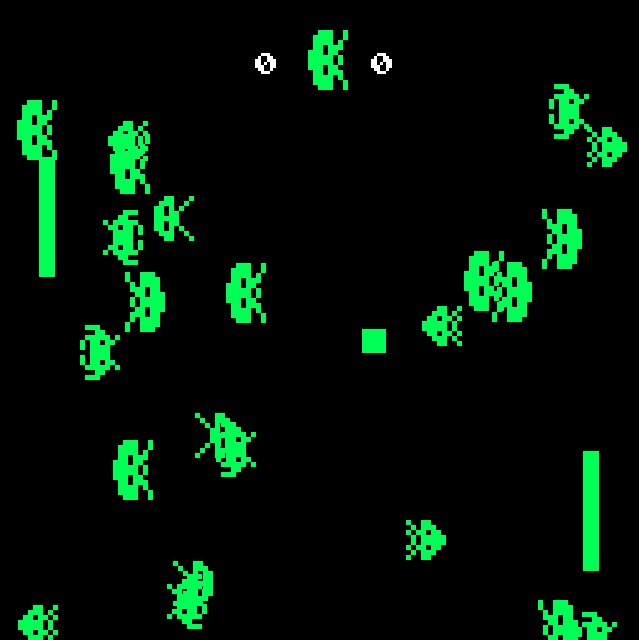

GPN17 Pong Invaders for GPN Badge
=============

Pong Invaders is a client/server multiplayer Pong game.
You use your [GPN Badge](https://entropia.de/GPN17:Hack_the_Badge) to control the paddles and play co-op multi-player against an almost perfect AI.

Derived from a Pong clone written in C++ with SDL 2.0.
Fixed game physics for larger screens, added multiplayer network with Boost.Asio, injected creepy space invaders, optionally enable PixelFlut, and made a gazillion of small changes at the [17. Gulaschprogrammiernacht GPN'17](https://entropia.de/GPN17).



## Dependencies

You will need:

+ [SDL 2.0](https://www.libsdl.org/)
+ [SDL TTF 2.0](https://www.libsdl.org/projects/SDL_ttf/)
+ [Boost.Asio](http://www.boost.org)

### Ubuntu

Install all dependencies on Ubuntu 14.04 and above:

`sudo apt-get install libsdl2-dev libsdl2-ttf-dev libboost-all-dev`

### Mac OS X

Install the required build dependencies using [Homebrew](http://brew.sh/):

`brew install sdl2 sdl2_ttf boost`

## Get Source and Build

```
git clone https://github.com/bingmann/gpn17-pong-invaders
cd gpn17-pong-invaders
make
```

## Run the game

To run the game:

`./pong`

## License and Credits

Pong code is MIT licensed

```
The MIT License (MIT)

Copyright (c) 2016 Chafic

Permission is hereby granted, free of charge, to any person obtaining a copy of
this software and associated documentation files (the "Software"), to deal in
the Software without restriction, including without limitation the rights to
use, copy, modify, merge, publish, distribute, sublicense, and/or sell copies of
the Software, and to permit persons to whom the Software is furnished to do so,
subject to the following conditions:

The above copyright notice and this permission notice shall be included in all
copies or substantial portions of the Software.

THE SOFTWARE IS PROVIDED "AS IS", WITHOUT WARRANTY OF ANY KIND, EXPRESS OR
IMPLIED, INCLUDING BUT NOT LIMITED TO THE WARRANTIES OF MERCHANTABILITY, FITNESS
FOR A PARTICULAR PURPOSE AND NONINFRINGEMENT. IN NO EVENT SHALL THE AUTHORS OR
COPYRIGHT HOLDERS BE LIABLE FOR ANY CLAIM, DAMAGES OR OTHER LIABILITY, WHETHER
IN AN ACTION OF CONTRACT, TORT OR OTHERWISE, ARISING FROM, OUT OF OR IN
CONNECTION WITH THE SOFTWARE OR THE USE OR OTHER DEALINGS IN THE SOFTWARE.
```

Original Pong Created by [Chafic Najjar](https://github.com/chaficnajjar).

NES Chimera Font by [Brian Kramer](https://www.pkeod.com/).

Network stuff and GPN-Badge code by [TimoB](https://github.com/bingmann/).
